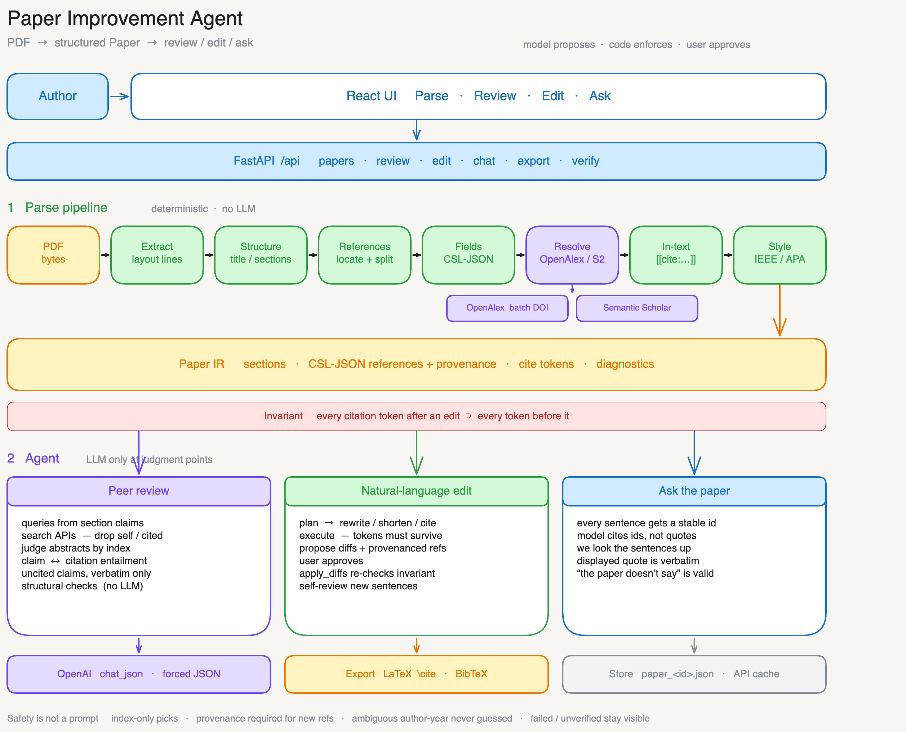
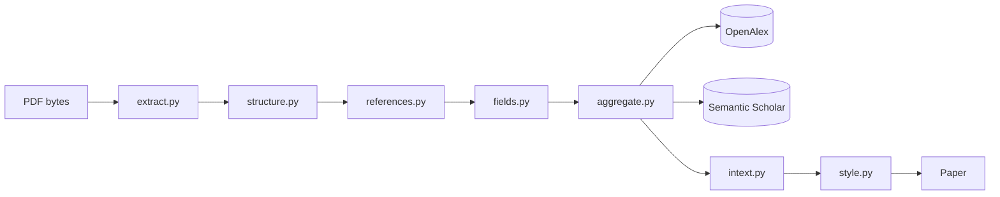
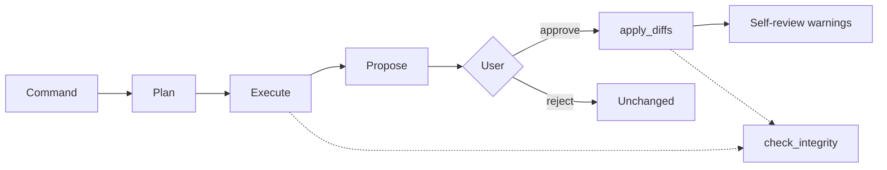

# System Design

Paper Improvement Agent turns a research-paper PDF into a structured
document with normalized CSL-JSON citations, then runs peer review and
natural-language editing without silently dropping or fabricating those
citations.

The two pieces that have to be right:

1. **Parsing** — PDF bytes → a `Paper` whose references are CSL-JSON and
   whose in-text markers are mechanically checkable tokens.
2. **The agent** — peer review and editing as small, JSON-only LLM calls
   around deterministic code. The model proposes; code enforces; the user
   approves.

The architecture described in this document is my own design — the
pipeline stages, the CSL-JSON intermediate representation, the token
invariant, and the agent's grounding rules. Cursor was used as a coding
assistant for implementation and testing, not for the design itself.

Editable whiteboard: [architecture.excalidraw](architecture.excalidraw)
(open in [excalidraw.com](https://excalidraw.com) → *Open* , or with the
VS Code / Cursor Excalidraw extension).



```mermaid
flowchart TB
  author[Author] --> ui[React UI<br/>Parse · Review · Edit · Ask]
  ui --> api[FastAPI /api]

  pdf[PDF bytes] --> extract[Extract<br/>layout lines]
  extract --> structure[Structure<br/>title / sections]
  structure --> refs[References<br/>locate + split]
  refs --> fields[Fields<br/>CSL-JSON]
  fields --> resolve[Resolve]
  resolve --> openalex[OpenAlex]
  resolve --> s2[Semantic Scholar]
  resolve --> intext[In-text<br/>cite tokens]
  intext --> style[Style<br/>IEEE / APA]
  style --> paper[Paper IR<br/>sections · refs · tokens · diagnostics]
  api --> paper

  paper --> review[Peer review]
  paper --> edit[NL edit]
  paper --> ask[Ask the paper]
  review --> llm[OpenAI chat_json]
  edit --> llm
  ask --> llm
  edit --> export[LaTeX / BibTeX]
  paper --> store[data/paper_id.json]

  paper -.-> invariant[Invariant: token multiset after ⊇ before]
```

There is no agent framework. The loop is owned in ~a few hundred lines
so every control-flow decision is inspectable and testable. What this
app needs — typed edit operations, a citation-integrity gate, honest API
error surfacing — is domain logic either way.

---

## 1. Citation parsing: PDF → CSL-JSON

The pipeline is a cascade of specialized stages on layout tokens, not
raw text. Every stage emits `Diagnostic` records. Failure is data that
flows to the Parse tab, never a silent drop.



```
PDF bytes
  → extract.py     PyMuPDF text items → layout-aware lines
  → structure.py   title, abstract, numbered/named sections
  → references.py  locate the list, segment entries
  → fields.py      per-entry CSL-JSON + parse_status
  → aggregate.py   resolve against OpenAlex / Semantic Scholar
  → intext.py      marker ↔ entry binding, tokenize body
  → style.py       IEEE vs APA from the marker mix
Paper { title, abstract, sections[], references[], intext[],
        style, diagnostics[] }
```

Implemented in `backend/app/parsing/` and `backend/app/search/`.
Orchestrated by `parsing/pipeline.py`.

### 1.1 Extract (`parsing/extract.py`)

PyMuPDF `get_text("dict")` yields spans with font, size, bold, and
bounding box. Rotated runs (arXiv sidebar banners, figure axis labels)
are skipped. Spacing accents from older LaTeX fonts (`G¨ulçehre`) are
recombined into NFC. Page numbers at the bottom edge and the full arXiv
stamp line are dropped; a bare `arXiv:1607.06450` inside a reference
entry is kept.

Running headers/footers are removed GROBID-style: identical text
repeating near the same page edge on 3+ pages is furniture.

IR: a list of `Line { text, size, bold, x0, y0, page, page_width }`.
A text-free (scanned) PDF yields an explicit `no-text` diagnostic, not
an empty paper that looks successfully parsed.

### 1.2 Structure (`parsing/structure.py`)

Body font size = length-weighted dominant size. Title = largest-font
line cluster near the top of page 1 (not the first numbered heading,
which ICLR-style papers often set larger than the title).

Heading signals, all required to fire together where noted:

- numbered lines (`1`, `3.2`, `I.`) in a larger or bold font
- canonical names (Abstract, Introduction, References, Works Cited, …)
- short standalone lines that are clearly larger or bold

Guards: numbered list items that continue in lowercase after a colon
are rejected; a leading number > 99 is rejected (`2018. URL …` is a
wrapped bibliography line, not a section). Split headings
(`"3"` + `"Model Architecture"` on the same baseline) are re-joined.
Sub-body-size lines (footnotes, captions) stay out of section prose.
Hyphenated wraps and split arXiv ids (`abs/1611.` + `06194`) are
repaired.

Failure modes: `no-title`, `no-headings`, `no-abstract` — each
surfaced, never guessed.

### 1.3 Locate and segment references (`parsing/references.py`)

Primary: the *last* heading matching References / Bibliography /
Works Cited / Literature Cited (last, because a table of contents can
mention it earlier). The region runs to the next post-reference heading
(Appendix, Acknowledgments) or to leaked table rows / figure captions.

Fallback when no heading matches: citation-density scan over the final
third of the document — the longest run of citation-shaped lines
(`[n]`, `n.`, author-initials), reported as an explicit
`no-heading-fallback` diagnostic so the user knows the location was
inferred.

Segmentation, in order of reliability:

1. Bracketed numbers (`[12] Author …`) — including mid-line markers
   that two-column extraction concatenates onto one line.
2. Dotted numbers (`12. Author …`).
3. Hanging-indent geometry, **per page and column**. Entry starts sit
   at a shallower `x0` than wrapped continuations. A single global
   margin would glue every right-column entry onto its predecessor.
4. Author-name regex fallback.

Numbered sequences are validated: a gap (`[2] → [4]`) is a surfaced
`sequence-gap` diagnostic, and implausibly short segments are kept
with their text. Anything that cannot be segmented is returned as a
raw remainder — surfaced, never dropped.

### 1.4 Field extraction (`parsing/fields.py`)

Local extraction first, then API resolution.

- DOI and arXiv / CoRR `abs/` ids by pattern (including wrapped
  `abs/1611. 06194`)
- Year: parenthesized (APA), sentence-year (ACL `Authors. 2018. Title.`),
  otherwise the last plausible year that is not a page span. Letter
  suffixes (`2024a`) are stripped from the year value.
- Title: quoted segment is the strongest signal (IEEE `"Title,"`,
  including IEEE Access `‘‘Title,’’`); else the segment after the
  parenthesized year; else the first long non-venue sentence.
- Authors: family/given split, with surname particles (`van der Maaten`)
  kept on the family. Org / consortium names (`AI@Meta`, `DeepSeek-AI`)
  are stored as CSL `literal` — imperfect data beats dropped data.
- Venue / volume / pages when the trailing text looks like a journal
  or “In Proceedings …” line.

Every item gets `parse_status`: `parsed` (title + year), `partial`, or
`failed`. Failed entries keep their raw text and still appear in the
UI and the exported LaTeX.

### 1.5 Resolution (`search/aggregate.py`, `search/match.py`)

Identifier lookups are batch-first so a 40-reference paper is a handful
of requests, not N rate-limit rolls:

1. All DOIs in one OpenAlex OR-filter (`filter=doi:A|doi:B`, 50/batch).
2. Leftover DOIs and arXiv ids in one Semantic Scholar
   `POST /paper/batch` (up to 500 ids).
3. Only leftovers hit per-entry title search.

Title matches follow Crossref’s SBMV design: **search similarity alone
never earns `verified`**. Every candidate ≥ 0.75 token similarity
(containment rule for truncated title guesses) is checked against the
reference’s year (±1) and the candidate first author’s surname in the
raw entry. A corroborated candidate is preferred over a higher-scoring
uncorroborated one — a title fully contained in a longer wrong title
must not win. Contradictions demote to `low-confidence`. Only a
near-perfect title verifies without corroboration.

```
identifier hit          → verified
title + year or author  → verified
title only, score ≥ 0.9 → verified
title only, score ≥ 0.75→ low-confidence
no match / HTTP error   → unverified   (real reason kept)
```

Verified / low-confidence entries attach `Provenance { source,
external_id, url, abstract }`. Local CSL is kept for bibliography
rendering; the paper page lives on provenance so citeproc never prints
a search-results URL. API access goes through a content-addressed disk
cache (`backend/data/cache/`). Outages degrade to honest unverified
states, never fabricated matches.

Retry verification (`POST /api/papers/{id}/verify`) re-resolves only
unverified and low-confidence entries. Verified entries, approved
edits, and history are left alone.

### 1.6 In-text linking (`parsing/intext.py`)

Style detection counts pattern hits; the dominant pattern maps to a
CSL style later. Markers themselves are extracted regardless.

| Style | Forms | Binding |
|---|---|---|
| Numeric | `[n]`, `[n, m]`, `[n–m]` | list index; ranges expanded |
| Author-year, parenthetical | `(Smith et al., 2020; Jones, 2019)` | first-author family + year |
| Author-year, narrative | `Smith et al. (2020)` | same |

Author-year extras:

- Whole-token match only — short org names (`AI`) are not wildcards.
- Org authors keep their full token (`AI@Meta`).
- Natbib suffix groups expand (`2023, 2024a,b` → three lookups).
- Letter suffixes disambiguate same-author-same-year via the raw entry.
- Multiple surviving candidates are **ambiguous**: reported, never
  guessed. A silently wrong link is citation corruption.

Resolved markers become tokens in the section text:

```
… prior work [3, 12].     →    … prior work [[cite:ref3,ref12]].
```

Unresolved markers stay verbatim and are listed. Never-cited reference
entries are a diagnostic, not a deletion.

### 1.7 Style (`parsing/style.py`)

Numeric-dominant → IEEE (`ieee.csl`). Author-year-dominant → APA
(`apa.csl`). The user can override in the UI. A consistency lint flags
a small minority of the other style (one numbered citation in an
author-year paper).

### Where CSL-JSON fits

One canonical model. Every citation — parsed from the PDF or fetched
from an API — is a CSL-JSON item plus provenance. All *formatting*
(inline labels, bibliography, both styles) goes through citeproc-py
and the official `.csl` files in `citations/styles/`. There are no
hand-written citation templates.

### The token invariant

Section text is stored tokenized. Tokens make citations mechanically
checkable: an edit is valid only if the multiset of tokens after
contains every token from before (unless an explicit, user-visible
`allowed_removals` set says otherwise). The UI and the LaTeX export
substitute tokens back through CSL.

### Failure handling (end-to-end)

| What went wrong | What the user sees |
|---|---|
| Scanned / image PDF | `extract` error: no text |
| No title / abstract / headings | diagnostic; body still shown |
| No References heading | density-scan fallback, or `not-found` |
| Unsegmentable block | raw remainder, `parse_status=failed` |
| Sequence gap `[2] → [4]` | warning; entries kept |
| Field parse failed | raw text + `failed` badge |
| API miss / rate limit | `unverified` + real reason; Retry |
| Title match without year/author | `low-confidence` |
| Orphan marker `[99]` | left verbatim, listed unresolved |
| Ambiguous `(Smith, 2020)` | left verbatim, not linked |
| Uncited bibliography entry | info diagnostic |

This matches the three-rubric framing in the citation-verifier
literature: *structural* verification is the CSL parse, *resolvability*
is API resolution with links, *semantic* is the claim checker.

---

## 2. The agent: peer review + editing + Q&A

Design follows the “predictable path is a hardcoded workflow, the
unpredictable one is a small tool-use loop, safety is deterministic
code” split. Every model call goes through `agent/llm.py`
(`chat_json`: forced JSON, no freeform parsing). A missing API key is
a clear 503, not a broken page.

### 2.1 The grounding rule

The LLM is never the source of a citation. In every prompt where the
model “chooses” a work, it can only pick **by index from a candidate
list we fetched**. Picks outside the list are discarded. New
references carry `Provenance` and `ops.apply_diffs` refuses any new
reference without API provenance. Fabricating a source is structurally
impossible, not merely discouraged.

Search also drops the paper itself (title similarity ≥ 0.9) and
already-cited works (DOI or normalized title) before the model sees
them.

### 2.2 Peer review (`agent/review.py`) — hardcoded workflow

A four-pass pipeline. The LLM makes narrow judgments; code does
everything else. Acknowledgments, appendices, and the reference list
are skipped. Runs are capped (`MAX_SECTIONS = 6`,
`MAX_CITATION_CHECKS = 15`) and the caps are reported as findings.

**Missing work** — per major section:

1. LLM extracts ≤2 search queries from the section’s claims (JSON).
2. Both APIs are searched; results merged and deduped.
3. LLM judges real abstracts and picks at most two, by index, with
   rationale and confidence. Empty is preferred over padding.
4. Honest “nothing found” findings when the APIs return nothing new.

**Claim ↔ citation match** — per in-text citation:

1. The claim is the sentence containing the token (sentence splitter
   shared with editing and Q&A).
2. The cited work’s stored abstract is used; if missing, one
   `resolve_reference` call. No abstract → `unverifiable`, never
   guessed.
3. LLM judges `supports` / `partially_supports` / `does_not_support` /
   `cannot_tell` from the abstract alone. The verdict labels say so.

**Uncited claims** — the LLM lists sentences that assert prior work or
empirical facts with no citation token. Candidates are kept only if
they appear *verbatim* in the text and genuinely have no token, so the
model cannot invent a problem that isn’t there.

**Structural checks** — no LLM:

- citation bundles (4+ works cited together for one claim)
- first-author concentration (≥4 refs and ≥10% of the list)

Every finding that names a work links to the real OpenAlex or Semantic
Scholar page.

### 2.3 Natural-language editing (`agent/editor.py` + `agent/ops.py`)

A command such as “add more citations to the introduction” becomes a
proposal, not a mutation.



```
command
  → Plan     one LLM call → {rewrite | shorten | add_citations} × section id
  → Execute  per op, with a mechanical integrity check
  → Propose  EditProposal { diffs, new_references, notes, warnings }
  → Approve  apply_diffs re-checks against the *current* paper
  → Self-review  new/reworded sentences only, as warnings
```

**rewrite / shorten.** The model edits tokenized text under a hard
rule: every `[[cite:…]]` token must survive character-for-character,
same count. `check_integrity` compares token multisets. A violation
gets one corrective retry; then the op is marked failed and the
section is left untouched. The error names the token and the before
vs. after counts.

**add_citations.** Queries are extracted, both APIs searched, and the
model places candidates *by index* at specific sentences. New tokens
are inserted by our code, not by model text generation. New
`Reference` rows carry full provenance and `added_by_edit=True`.

**Approve.** `apply_diffs` refuses: a dropped token, an unknown token,
or a new reference without API provenance. The check runs against the
paper as it is *now*, so a stale proposal cannot clobber a later edit.

**Self-review.** Editing can create the problem review detects — a
claim without support. After apply, only the sentences the edit
introduced or reworded are re-run through the uncited-claim check.
Hits become warnings on the proposal. They never block an approved
edit.

**Undo.** The most recent applied edit can be reverted only if the
affected sections are still exactly as that edit left them. The same
integrity check protects every pre-existing citation; only references
the proposal itself introduced may disappear, and only once nothing
cites them.

### 2.4 Ask the paper (`agent/qa.py`)

Answers come from the paper’s own text only. Every sentence gets a
stable id (`sec15#3`). The model cites the ids its answer rests on;
we look the sentences up ourselves. A displayed quote is verbatim
paper text by construction. Invalid ids are dropped and the answer
flagged. “The paper doesn’t say” is a first-class answer. Source
chips jump to the quoted section; involved references are linked.

### 2.5 Citation integrity (the non-negotiable)

```
check_integrity(old, new, allowed_removals=∅)
    for each ref_id in tokens(old):
        if count(new, ref_id) < count(old, ref_id)
            and ref_id ∉ allowed_removals:
                reject, with exact counts
```

The LLM proposes; code enforces; the user approves. The validator is
not a prompt, so it is not repairable by prompting. It runs at
proposal time (inside the rewrite loop) and again at approval time.
The test suite covers drop / move / delete / fabricate / unprovenanced
/ undo-after-later-edit.

---

## 3. When verification happens

Three moments, one honesty rule.

1. **Parse time.** Every parsed reference is resolved (batch
   identifiers, corroborated title search). Badges, links, and
   abstracts exist before any LLM is involved.
2. **Edit time.** A citation the agent wants to add is verified as
   part of its own search. It cannot enter the document otherwise.
3. **On demand.** Unverified / low-confidence entries have Retry
   verification. The document id, approved edits, and history survive;
   verified entries are never re-touched.

Review time adds no re-verification: it reasons on the parse-time
foundation (claim checks use stored abstracts, and only when an
abstract exists).

---

## 4. External APIs

| Service | Used for | Auth |
|---|---|---|
| OpenAlex | search, DOI batch, title leftover | none (`mailto` courtesy) |
| Semantic Scholar Graph | search, DOI/arXiv batch, title leftover | optional key (higher limits) |
| OpenAI | review, edit, Q&A (JSON-only) | `OPENAI_API_KEY` required |

Clients (`search/openalex.py`, `search/semantic_scholar.py`) are thin
and honest: network errors return empty results, never fabricated
records. Every call is keyed in `data/cache/` by a hash of
service + endpoint + params + body, so demos replay offline and
re-runs cost zero API calls.

---

## 5. Persistence and API

`store.py` writes one JSON file per paper under `backend/data/`. The
parsed document, findings, and edit proposals all survive a refresh.
Reopening a paper costs zero tokens.

This is a single-user assessment app: no job queue, no durable
workflow runner. The production-shaped next step would detach long
review runs from the HTTP connection (a worker keyed by paper id) and
move `data/` to object storage; the store module is the only file that
would have to change.

| Method | Path | What it does |
|---|---|---|
| `POST` | `/api/papers` | upload PDF, parse, persist |
| `GET` | `/api/papers/{id}` | paper + rendered bibliography + findings + proposals |
| `POST` | `/api/papers/{id}/style` | override IEEE / APA |
| `POST` | `/api/papers/{id}/verify` | retry unverified references |
| `POST` | `/api/papers/{id}/review` | run the four review passes |
| `POST` | `/api/papers/{id}/edit` | propose an edit (does not mutate) |
| `POST` | `/api/papers/{id}/proposals/{pid}` | approve / reject / undo |
| `POST` | `/api/papers/{id}/chat` | grounded Q&A |
| `GET` | `/api/papers/{id}/export` | `format=latex` or `bib` |

---

## 6. Export

`export/latex.py` rebuilds the paper: section hierarchy from levels,
LaTeX-escaped text, tokens converted to `\cite{refN}` (unknown markers
stay as text, never fabricated into keys), and a `thebibliography`
whose entries are each rendered through citeproc in the detected
style. Failed refs are included as raw text with a comment.

`export/bibtex.py` emits the same references as biblatex data for a
real round-trip. The `.tex` does not `\bibliography{}` the `.bib`
yet — that is listed as future work.

---

## 7. Frontend

Upload-first React app (`frontend/src/App.tsx`). The left pane is the
paper with clickable citation chips (`CiteText`). The right pane is
four tabs:

- **Parse** — coverage (parsed / resolved / API-verified), pipeline
  diagnostics, unresolved markers, CSL-rendered bibliography, Retry
  verification.
- **Review** — findings with real-source links and claim-check
  verdicts.
- **Edit** — natural-language command, diff approval with per-change
  notes, history, undo.
- **Ask** — grounded chat with jump-to-section source chips.

`CitationModal` explains a chip: rendered entry, parse + resolution
badges, abstract, and any claim-check verdict for that reference.

---

## 8. Module map

```
backend/app/
  parsing/      extract → structure → references → fields → intext → style
                pipeline.py orchestrates and attaches diagnostics
  citations/    csl.py (citeproc), styles/apa.csl, styles/ieee.csl
  search/       openalex.py, semantic_scholar.py, aggregate.py,
                match.py (SBMV), cache.py
  agent/        llm.py, review.py, editor.py, ops.py, qa.py
  export/       latex.py, bibtex.py
  api/routes.py REST
  store.py      JSON persistence under data/
  models.py     Paper, Reference, InTextCitation, Finding, EditProposal
frontend/src/
  App.tsx       upload-first flow, paper pane + four tabs
  components/   CiteText, CitationModal, ReferenceLink,
                ReferencesPanel, ReviewPanel, EditPanel,
                ChatPanel, UploadScreen
```

---

## 9. What is enforced in code, not in prompts

- Index-only candidate selection (out-of-range picks discarded).
- New references require API provenance.
- Token-multiset integrity on every rewrite and at apply time.
- Q&A quotes are looked up by id, never taken from model text.
- Uncited-claim candidates must appear verbatim and token-free.
- Title matches need year or author corroboration to be `verified`.
- Ambiguous author-year links are refused, not guessed.
- Failed parse / unresolved marker / unverified ref stay visible.

The LLM is confined to the decision points where probabilistic
reasoning helps: relevance, entailment, edit proposal. Everything
that would be a citation integrity bug if it went wrong is
deterministic software.
